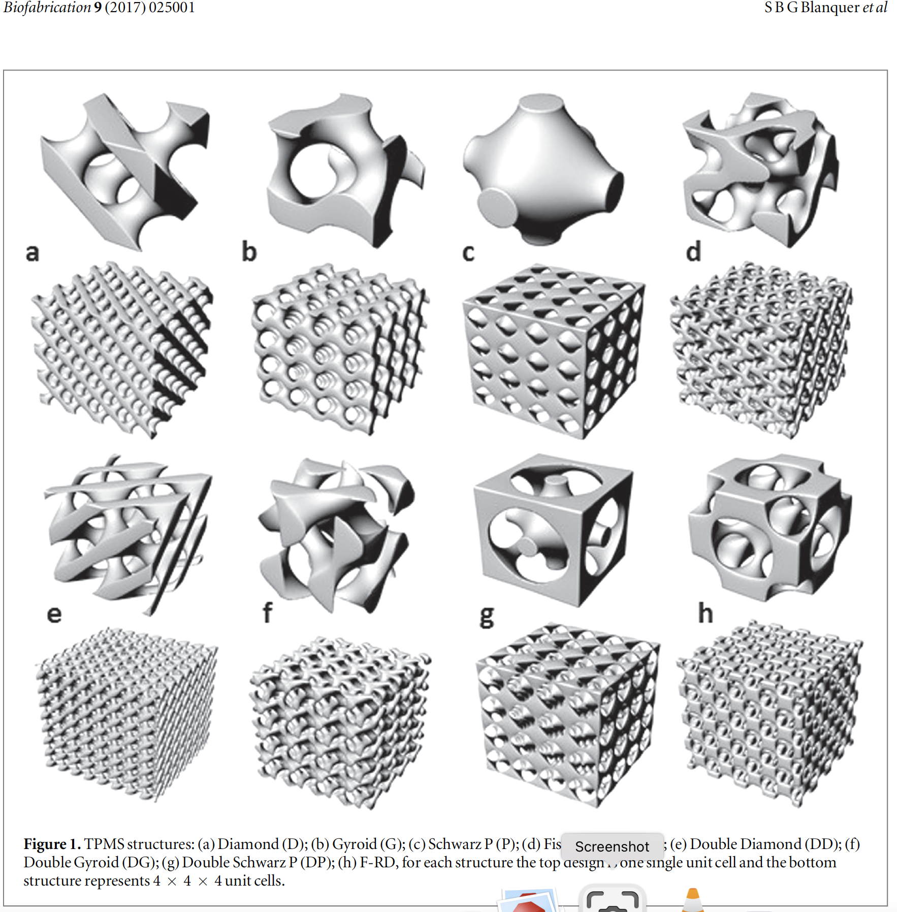
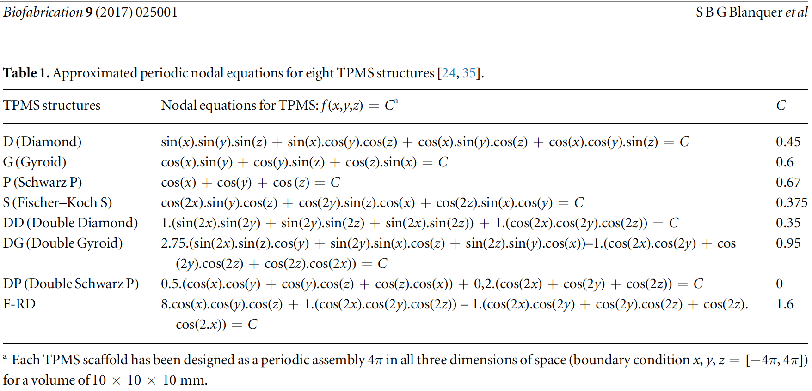

# Purpose

Explore Triply Periodic Minimal Surface (TPMS) structures as possible 3D printed high surface area components.

Possible applications:

- Compact mixers.
- Substitute for capture monoliths.
- Chromatography.
- Size-selective filters, including for bead capture.

# Approach

- Create unit cell with discrete blocks.
    - Integer number of blocks in each direction of the 3D unit cell.
    - Create a block if the center of the block is inside the TPMS.
- Save unit cell to STL file.
- Use unit cell by importing STL into a device design file.
- Scale unit cell so that each block corresponds to a pixel &times; pixel &times; layer thickness voxel.
- Place as many translated and scaled unit cells as needed to create desired TPMS region.
- Initial testing shows that using a single block-based unit cell STL is a lot faster than constructing a lot of unit cells out of blocks.

# Open questions

- Use TPMS unit cell as-is, or use it with a difference operation like all other negative space components.
    - If the former, substitute a large rectanguler box for the TPMS region in a negative space design, then fill the box with TPMS unit cells.
    - If the latter, need to create negative space TPMS unit cell.

# Thoughts

- Rotate so that original x-axis is oriented in x-y? This will prevent a straight-through path in the x-direction so that a flow in that direction will have to split many times.
- Try other TPMS structures.

# Next

- Try scenarios specific to MR1.1 fabrication.
- Continue packaging code so it is easy to use as a module.

